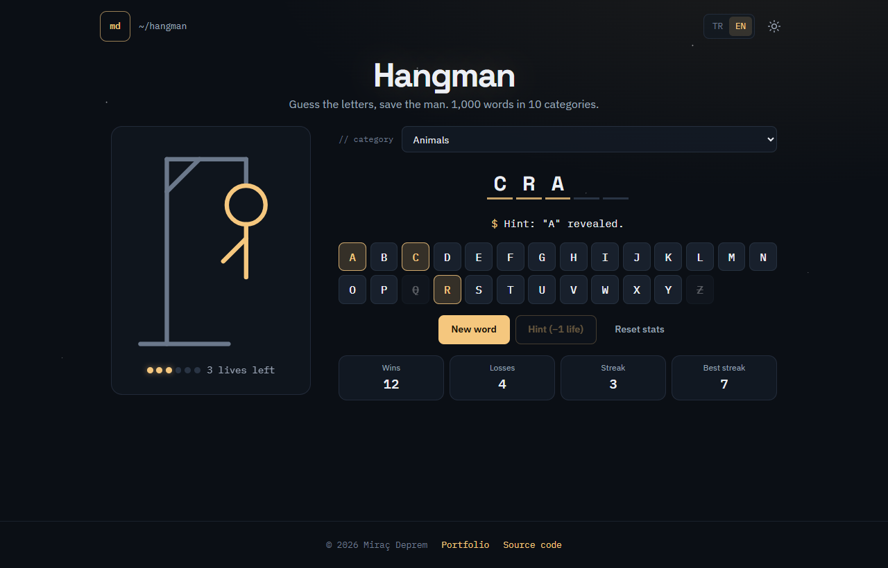
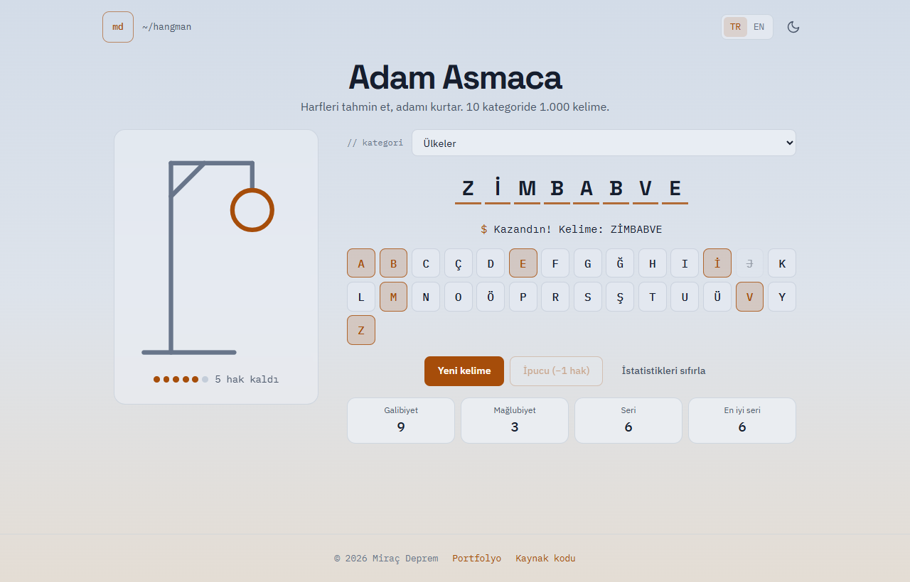
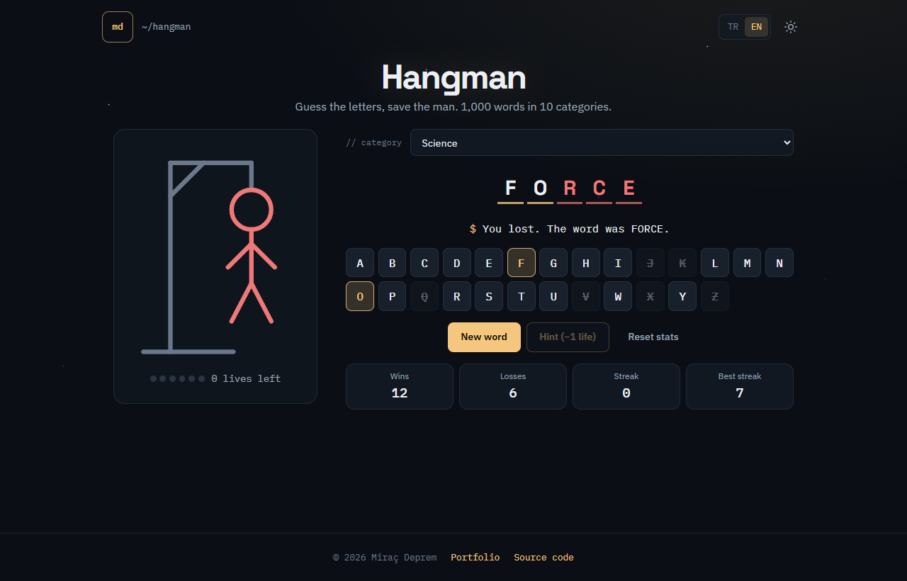
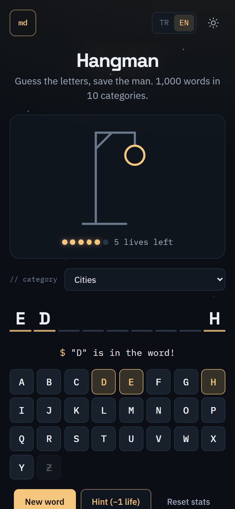

# Adam Asmaca (Hangman)

[English](README.md) | **Türkçe**

Sade HTML, CSS ve JavaScript ile yazılmış bir adam asmaca oyunu. Gizli kelimeyi, adam tamamen çizilmeden harf harf tahmin et. 10 kategoride 1.000 Türkçe ve 1.000 İngilizce kelime var.

**Canlı demo:** [hangman.miracdeprem.com](https://hangman.miracdeprem.com)



## Özellikler

- **10 kategori, 2.000 kelime:** hayvanlar, ülkeler, şehirler, yiyecek ve içecek, meslekler, teknoloji, spor, doğa, ev ve bilim. Her kategoride 100 Türkçe ve 100 İngilizce kelime var.
- **Tahmin**
  - Ekrandaki klavyeyle ya da kendi klavyenle tahmin edersin.
  - Alfabe dile göre değişir: Türkçede 29 harf (ç, ğ, ı, ö, ş, ü), İngilizcede 26 harf var.
  - Türkçe büyük-küçük harf kuralları doğru işlenir: Caps Lock açıkken `I` harfi `ı`, `İ` harfi `i` sayılır.
- **6 hak:** Her yanlış tahminde adamın bir parçası çizilir. Aynı harfi tekrar basmak, rakam ya da Ctrl+R gibi kısayollar hak götürmez.
- **Zor kelimeler için yardım**
  - **İpucu butonu:** Bir hak karşılığında gizli bir harf açar, kelime başına bir kez kullanılır. Son hakta ve tek harf kaldığında kilitlenir.
  - **Uzun kelimeler** bir iki harfi açık başlar (8-10 harf: 1, 11 ve üstü: 2).
- **Tekrarsız kelime:** Sayfa açık kaldığı sürece kategorideki her kelime bir kez oynanmadan hiçbir kelime tekrar gelmez.
- **İstatistikler:** Galibiyet, mağlubiyet, seri ve en iyi seri; sayfa yenilense de korunur.
- **Erişilebilir**
  - Tamamen klavyeyle oynanabilir; tur bitince Enter yeni kelime getirir.
  - Ekran okuyucu kelimenin durumunu ("Kelime, 5 harf: C, R, A, boş, boş") ve her tuşun durumunu okur.
  - Sistemdeki "hareketi azalt" ayarına uyar.
- **Türkçe ve İngilizce**, [portfolyo sitemle](https://www.miracdeprem.com) uyumlu **koyu ve açık tema**.
- **Duyarlı tasarım:** Masaüstünde iki sütun, telefonda tek sütun; uzun kelimeler her zaman tek satırda kalır.
- **Geri bildirim:** Küçük bir düğme; ad (isteğe bağlı), e-posta ya da telefon ve mesaj içeren formu açar. Mesaj portfolyo sitem üzerinden doğrudan bana ulaşır.

## Ekran Görüntüleri

| Kazanma, açık tema (Türkçe) | Kaybetme | Telefon |
|---|---|---|
|  |  |  |

## Kullanılan Teknolojiler

- HTML, CSS, JavaScript (ES modülleri, framework yok, derleme adımı yok)
- Node.js'in yerleşik test aracı (`node --test`), 21 birim testi
- Yayın: Vercel, güvenlik başlıklarıyla (Content Security Policy)

## Kurulum ve Çalıştırma

[hangman.miracdeprem.com](https://hangman.miracdeprem.com) adresinden çevrim içi oynayabilir ya da kendi bilgisayarında çalıştırabilirsin:

```bash
git clone https://github.com/MrcDprm/hangman-game.git
cd hangman-game
python -m http.server 5173
```

Sonra `http://localhost:5173` adresini aç. Kelime listeleri `fetch` ile yükleniyor ve ES modülleri `file://` üzerinden çalışmıyor; bu yüzden yerel bir sunucu gerekir. Herhangi bir statik sunucu olur.

Testleri çalıştırmak için (Node.js 20 veya üstü):

```bash
npm test
```

### Proje yapısı

```
data/words-tr.json  Türkçe kelimeler (10 kategori × 100)
data/words-en.json  İngilizce kelimeler (10 kategori × 100)
src/game.js         Oyun kuralları: tahmin, hak, ipucu, kazanma ve kaybetme
src/words.js        Kelime listelerini yükler ve doğrular, tekrarsız kelime seçer
src/storage.js      Ayarlar ve istatistikler (localStorage, doğrulamalı)
src/i18n.js         Türkçe ve İngilizce metinler
src/theme.js        Tema değiştirme
src/theme-init.js   Kayıtlı temayı sayfa çizilmeden önce uygular
src/main.js         Hepsini sayfaya bağlar
tests/              Kurallar, kelime listeleri ve kayıt için birim testleri
```

## Öğrendiklerim

- **Dile göre metin işlemek.** `"I".toLowerCase()` sonucu `"i"`, ama Türkçede `I` harfinin küçüğü `ı`. `toLocaleLowerCase('tr')` ve `toLocaleUpperCase('tr')` kullanarak tahminlerin ve ekrandaki kelimenin her dilin kurallarına uymasını sağladım.
- **`fetch` ile veri yüklemek.** Kelime listeleri sadece seçilen dil için yüklenen JSON dosyaları. `async`/`await` kullandım. Yükleme işlemini (Promise) önbellekte tuttum, böylece her dosya bir kez indiriliyor. Yükleme başarısız olursa kaydı önbellekten sildim, bir sonraki denemede dosya yeniden indiriliyor.
- **Dosyadan gelen veriye güvenmemek.** Her kelime kullanılmadan önce kontrol ediliyor: sadece bilinen kategoriler, sadece o dilin alfabesindeki harfler, en az üç harf. Dosya yüklenemezse oyuncu sade bir mesaj görüyor, teknik ayrıntı geliştirici konsolunda kalıyor.
- **Adil karıştırma.** Kelimeler Fisher-Yates karıştırmasıyla hazırlanan bir "torbadan" çekiliyor. Her sıralama eşit olasılıkla çıkıyor ve torba boşalmadan hiçbir kelime tekrar gelmiyor. Torba bir closure'ın içinde duruyor, dışarıdan değiştirilemiyor.
- **Her değişiklik için tek yol.** Tahmin de ipucu da yeni bir oyun durumu döndürüyor. İstatistik kaydını ve ekranı çizmeyi tek bir `update` fonksiyonu yapıyor. Fonksiyonları parametre olarak geçirmek (`update(useHint)`) bu kodu tek yerde tuttu.
- **Yarış durumu (race condition).** Kelimeler yüklenirken oyuncu dil değiştirirse eski istek yeni oyunun üstüne yazmamalı. `await` sonrasında ayarları yeniden kontrol ederek bunu çözdüm.
- **SVG ve CSS ile çizim.** Adamın her parçası `pathLength="1"` verilmiş bir SVG çizgisi. Böylece tek bir CSS geçişi, gerçek uzunluğu ne olursa olsun her parçayı aynı şekilde "çiziyor".
- **İçeriğe göre boyutlandırma.** Harf kutuları CSS container birimleri ve bir `--letters` değişkeniyle boyutlanıyor. 14 harflik bir kelime küçük bir telefonda bile tek satıra sığıyor.

## Gelecek Planları

- Kelime uzunluğuna göre zorluk
- Bir oyuncunun kelimeyi girdiği iki kişilik mod
- Daha fazla kategori

## Lisans

[MIT](LICENSE)
